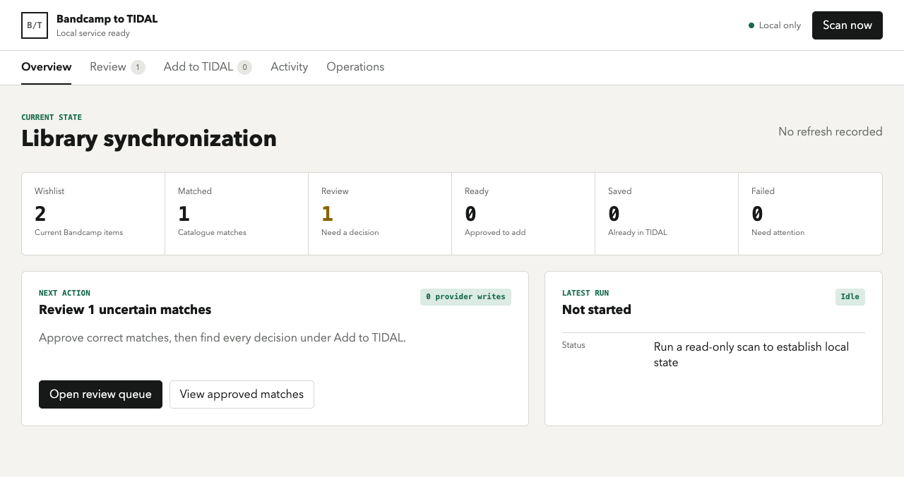
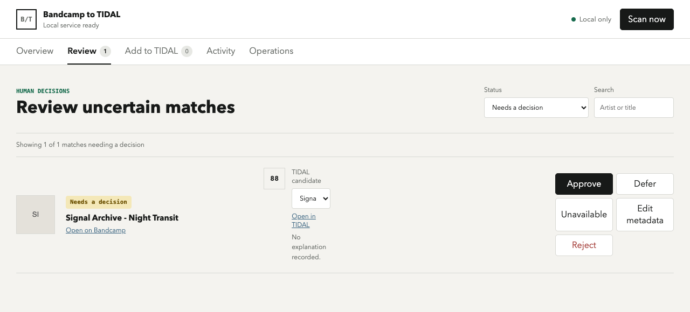

# Bandcamp Wishlist to TIDAL

Keep a public Bandcamp wishlist and a TIDAL library in sync, with a human
review step before anything can change in TIDAL.

This local-first tool finds TIDAL matches for albums saved on Bandcamp, shows
uncertain matches side by side, and prepares a clear list of additions.
Refreshing and reviewing never writes to your TIDAL account.



The review queue keeps the human decision visible and separate from any write:



## How it works

1. Enter the username of a **public** Bandcamp wishlist.
2. Connect TIDAL through its normal authorization page.
3. Start a read-only refresh. The app compares the wishlist with your TIDAL
   library and reuses previous results where possible.
4. Review uncertain matches in the local dashboard. Approve, reject, defer,
   mark an album unavailable, or choose a different TIDAL candidate.
5. Review the exact addition list. Only a separate, explicit confirmation can
   add albums to TIDAL.

The app never removes albums from TIDAL. If a TIDAL token expires, the dashboard
and diagnostics explain when reauthorization is needed.

## What you get

- A simple local dashboard for refresh, review, and addition preparation.
- Match explanations, confidence scores, links to both services, and artwork
  for the selected candidate.
- Clear categories for already saved, approved, needs review, unavailable, and
  not found albums.
- Incremental refreshes that detect new or removed wishlist items.
- Backups, activity history, and downloadable reports stored locally.
- Dry-run behavior by default and no telemetry.

## Safety and privacy

- Your Bandcamp wishlist must be public; no Bandcamp password is needed.
- TIDAL credentials and tokens stay on your computer and never reach the
  browser dashboard.
- The dashboard listens on `127.0.0.1` by default.
- Refresh, matching, review, and plan creation are read-only with respect to
  TIDAL.
- Adding albums requires an immutable reviewed plan plus explicit confirmation.

## Install and start

The latest release is available on the
[GitHub Releases page](https://github.com/nakedape2000/bandcamp-wishlist-tidal/releases/latest).
The dashboard is currently run from a repository checkout or with Docker. The
`.tgz` archive is also available for the CLI and packaged experiments; the
dashboard launcher will be included in a later release.

### Dashboard from a checkout

```sh
git clone https://github.com/nakedape2000/bandcamp-wishlist-tidal.git
cd bandcamp-wishlist-tidal
bun install
bun run review:web
```

Open <http://127.0.0.1:4173> in your browser. Stop the local service with
`Ctrl+C`.

### Package archive (CLI)

On macOS, Linux, or Windows, install the `.tgz` archive in an empty Bun
project:

```sh
mkdir bcts
cd bcts
bun init -y
bun add /path/to/bandcamp-tidal-sync-<version>.tgz
./node_modules/.bin/bandcamp-tidal-sync --help
```

On Windows PowerShell, replace the last two lines with:

```powershell
bun add C:\path\to\bandcamp-tidal-sync-<version>.tgz
.\node_modules\.bin\bandcamp-tidal-sync --help
```

Docker is also supported from a repository checkout (the `.tgz` package is the
Bun installation path):

```sh
docker compose config
docker compose up --build
```

Then open <http://127.0.0.1:4173>. Compose stores local state in `./data` and
binds the dashboard to localhost. See the complete
[installation and troubleshooting guide](docs/m9-installation.md).

## First use

When the dashboard opens, choose **Run first scan** or **Scan now**. The first
refresh may take time for a large TIDAL library; progress is shown and the
browser remains local. The overview then tells you how many albums were found,
matched, already saved, or need your decision.

The **Review** section is where you decide about uncertain matches. The **Add
to TIDAL** section is a separate safety boundary: inspect the exact albums,
check the confirmation, and only then choose to add them.

## Data location

For the current source checkout and release archive, local state stays beside
the project:

| Platform | Default location |
| --- | --- |
| Bun checkout or package project | `./config.json`, `./output/` |
| Docker | `./data` in the host folder |

The directory contains configuration, the SQLite database, reports, and the
TIDAL token. Do not commit it or upload it. A platform-specific data directory
and guided launcher are planned for a later release.

## Updating and recovery

Before an update, stop the service and copy the project-local `output/` folder
to a safe location. It contains the SQLite database, reports, and token.

Reinstall the previous archive or restore the copied folder to roll back.
Backups and restores never write to TIDAL.

## Limitations

- Only public Bandcamp wishlists are supported.
- TIDAL is currently the only destination provider.
- Spotify, Apple Music, and other services are not integrated yet.
- The Bandcamp endpoint used by the public website is undocumented and may
  change.
- The tool adds albums but does not remove anything from TIDAL.

## Advanced and developer information

The CLI remains available for automation, diagnostics, and recovery, but it is
not required for normal use. Start with the dashboard and installation guide.

- [Installation and troubleshooting](docs/m9-installation.md)
- [M9 verification runbook](docs/m9-verification.md)
- [Architecture](docs/architecture.md)
- [Privacy](docs/privacy.md)
- [Credential handling](docs/credentials.md)
- [Migration from older scripts](docs/migration.md)
- [Support matrix](docs/support-matrix.md)
- [Provider contract](docs/provider-contract.md)
- [Contributing](CONTRIBUTING.md)
- [Security policy](SECURITY.md)

For development, install Bun 1.x and run `bun install`. The full local gate is
`bun run verify:m9`; it uses fixtures and mocks and performs no provider writes.

## Disclaimer

This project is not affiliated with or endorsed by Bandcamp or TIDAL. Use it
for your own accounts, follow each service's terms, and review every proposed
addition before confirming it.

## License

[MIT](LICENSE)
